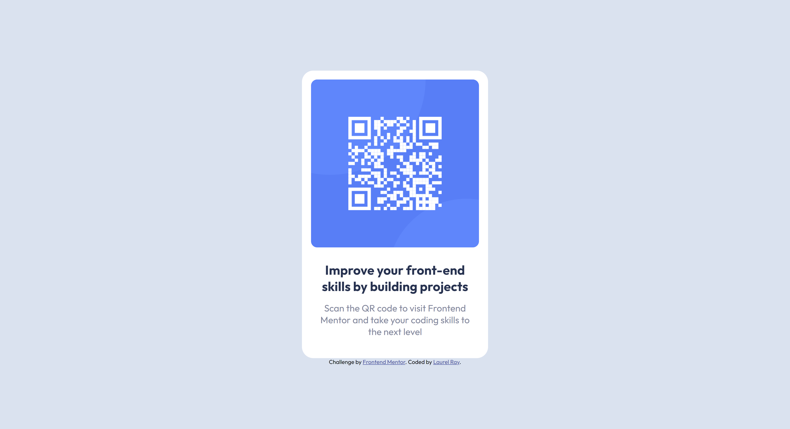

# Frontend Mentor - QR code component solution

This is a solution to the [QR code component challenge on Frontend Mentor](https://www.frontendmentor.io/challenges/qr-code-component-iux_sIO_H). Frontend Mentor challenges help you improve your coding skills by building realistic projects.

## Table of contents

- [Overview](#overview)
  - [Screenshot](#screenshot)
  - [Links](#links)
- [My process](#my-process)
  - [Built with](#built-with)
  - [What I learned](#what-i-learned)
  - [Continued development](#continued-development)

**Note: Delete this note and update the table of contents based on what sections you keep.**

## Overview

### Screenshot

Add a screenshot of your solution. The easiest way to do this is to use Firefox to view your project, right-click the page and select "Take a Screenshot". You can choose either a full-height screenshot or a cropped one based on how long the page is. If it's very long, it might be best to crop it.

Alternatively, you can use a tool like [FireShot](https://getfireshot.com/) to take the screenshot. FireShot has a free option, so you don't need to purchase it.

Then crop/optimize/edit your image however you like, add it to your project, and update the file path in the image above.

**Note: Delete this note and the paragraphs above when you add your screenshot. If you prefer not to add a screenshot, feel free to remove this entire section.**

### Links

- Solution URL: [https://github.com/laurel-ray/qr-code-component-main](https://github.com/laurel-ray/qr-code-component-main)
- Live Site URL: [https://laurel-ray.github.io/qr-code-component-main/](https://laurel-ray.github.io/qr-code-component-main/)

### Built with

- HTML5
- CSS
- Flexbox

### What I learned

This is one of my first projects after a long break from coding. I worked on this to refresh my memory without overwhelming myself with all the things I've forgotten and need to relearn. I learned I've got a long road ahead of me. 🙃

### Continued development

I need to review box model and positioning. I used straight CSS with this project but I'm looking forward to a slightly larger project where I can dust of SCSS in the future.

I need more work on accessibility and responsiveness.
